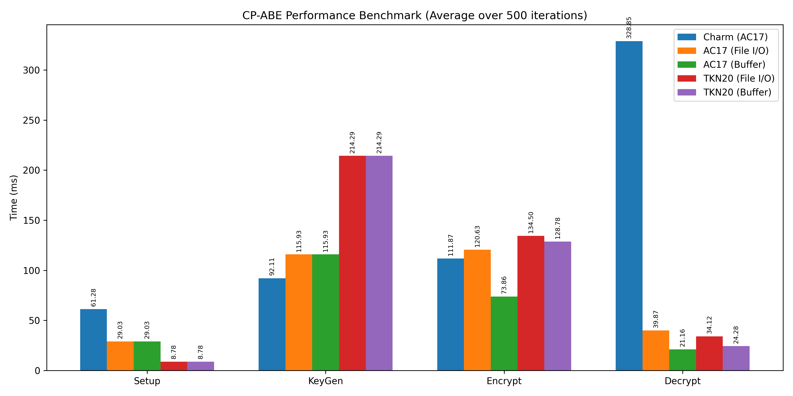
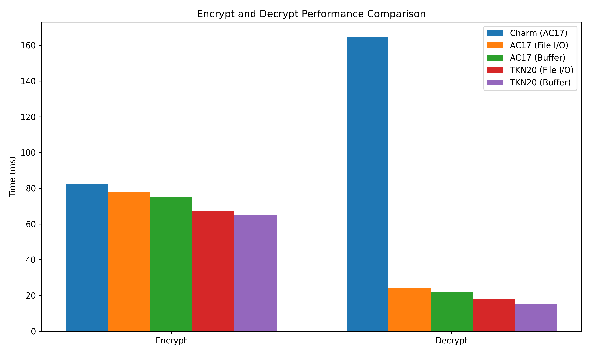

# Hybrid PQ-CP-ABE Library
Hybrid Post-Quantum Ciphertext-Policy Attribute-Based Encryption Library for C/C++ in Windows/Linux

> [!NOTE]
> This library natively includes **Post-Quantum Cryptography (PQC)** integration using `liboqs` (specifically ML-DSA-87 signatures). It introduces a secure "Sign-then-Encrypt" architecture to prevent Surreptitious Forwarding attacks. 


- [CryptoPP Library](https://github.com/weidai11/cryptopp)
- [CP-ABE AC17 Scheme](https://eprint.iacr.org/2017/807) (via [Rabe-ffi](https://github.com/WanThinnn/librabe.git))
- [CP-ABE TKN20 Scheme](https://eprint.iacr.org/2020/733) (via [Cloudflare CIRCL](https://github.com/cloudflare/circl/tree/main/abe))
- [liboqs](https://github.com/open-quantum-safe/liboqs) (Open Quantum Safe - required for PQC Signatures)
- [HashiCorp Vault Secrets Engine](src/go/README.md) (Native Go plugin for Enterprise Cryptography-as-a-Service)

## Why Use This Library? (Performance & Benchmarks)

This library implements a highly optimized **KEM/DEM Hybrid Encryption architecture** combining the advanced access control of CP-ABE (using `rabe` & Rust) with the blazing-fast symmetric encryption of AES-GCM (using `CryptoPP` & C++). 

### Quantum-Resistant "Sign-then-Encrypt" Architecture
This branch heavily upgrades the security model by integrating **Post-Quantum Signatures (ML-DSA-87)** via `liboqs` to protect against quantum adversaries! 
- **CCA Security & AAD Binding:** The AES-GCM symmetric encryption securely binds the Ciphertext Policy and PQC Public Key as Authenticated Additional Data (AAD) to prevent malleability.
- **Anti-Surreptitious Forwarding:** The ML-DSA-87 signature algorithm signs the `[Policy] + [Plaintext]` securely, preventing malicious users from re-encrypting the payload for unintended recipients.

When benchmarked against the standard Python-based `charm-crypto` library using the AC17 scheme, this library demonstrates massive performance advantages, especially during decryption:

*   **Lightning-fast Decryption (O(1) Decryption Time):** Thanks to Rust's intelligent Minimum Satisfying Subset evaluation and optimized multi-pairing techniques, the decryption time is almost constant regardless of how complex the policy is. While `charm-crypto` scales linearly and takes >200ms for complex policies (12 attributes), this custom library completes decryption in a flat **~23ms**.
*   **Hardware-accelerated AES-GCM (AES-NI):** By using `CryptoPP` for the Data Encapsulation Mechanism (DEM) phase, the actual file data is encrypted and decrypted in less than 1 millisecond.
*   **Zero Python Interpreter Overhead:** Being a pre-compiled native library (C++/Rust FFI), it eliminates the heavy overhead of the Python interpreter and Python object conversions, making it ideal for integration into high-performance backends, embedded systems, or mobile applications.

### Benchmark Results (Complex Policy - 12 Attributes)
<p align="center">
  
  <br/>
  
</p>

> [!NOTE]
> 
> The minor trade-off for this extreme decryption speed is a slightly slower encryption phase for very complex policies (due to the Rust `pest` parser generating the abstract syntax tree), but the massive decryption gains (nearly 10x faster) make it exceptionally well-suited for scalable real-world systems.

> [!WARNING]
> **Disclaimer (Scope of Library):** This library is highly specialized and is optimized for the **AC17** and **TKN20** CP-ABE schemes. It is built specifically to achieve maximum performance and seamless C++ integration. If your project requires a broader variety of cryptographic schemes (such as KP-ABE, IBE, etc.), we highly recommend using [Charm-Crypto](https://github.com/JHUISI/charm), which offers a vast and flexible collection of cryptographic primitives.

## Building (Multi-OS)

> [!NOTE]
> 
> **Note on Dependencies:** All necessary dependencies (`CryptoPP`, `liboqs`, `rabe-ffi`, `circl`) have already been pre-compiled and included in the `src/cpp/lib/` folder for your convenience. You can build the main library immediately without installing anything else. However, if you wish to re-build these dependencies from source (e.g., for a different architecture), please read the instructions in [`src/cpp/lib/README.md`](file:///src/cpp/lib/README.md).

1. Clone the repository and navigate to the C++ source directory:
    ```sh
    git clone https://github.com/WanThinnn/Hybrid-PQ-CP-ABE-Library.git
    cd Hybrid-PQ-CP-ABE-Library
    cd src/cpp
    ```

### Option 1: Using Make (Recommended)
We provide a unified `Makefile` that automatically detects your operating system and compiler.

- **On Windows**: Open the **x64 Native Tools Command Prompt for VS 2022** (or equivalent) and run:
  ```cmd
  make clean
  make all
  make test
  ```
  *(Note: If you use MSYS2 or MinGW `make`, it works seamlessly as well!)*

- **On Linux / WSL**: Open your terminal and run:
  ```bash
  make clean
  make all
  make test
  ```

**Available Make Commands:**
- `make all`: Builds the static library, shared library, and executable.
- `make static`: Builds only the static library (`.lib` or `.a`).
- `make shared`: Builds only the shared library (`.dll` or `.so`).
- `make executable`: Builds only the CLI executable.
- `make test`: Runs the test suite. See `src/cpp/test/run_test.sh` or `src/cpp/test/run_test.bat` for more information.
- `make clean`: Removes all build artifacts and temporary files.

### Option 2: Using Visual Studio Code
The repository is also configured with a smart `tasks.json` for VS Code.

- **On Windows**: Open VS Code from the **x64 Native Tools Command Prompt for VS 2022**.
- **On Linux / WSL**: Open VS Code natively.
- Press `Ctrl+Shift+B` to run the configured build task.
- **Windows** will build using MSVC (`cl.exe`), and **Linux** will build using `g++`.
## Usage

### Using the Executable


The usage of the executable is as follows:
```sh
Usage: main [command] [--scheme <name>] [--pqc] [options]
Usage: main setup [--scheme <name>] <path_to_save_file>
Usage: main genkey [--scheme <name>] <master_key_file> <attributes> <private_key_file>
Usage: main encrypt [--scheme <name>] <public_key_file> [pqc_private_key] <plaintext_file> <policy> <ciphertext_file>
Usage: main decrypt <private_key_file> [pqc_public_key] <ciphertext_file> <recovertext_file>
```

Example commands (Standard Mode):
```sh
main setup --scheme tkn20 test_case
main genkey --scheme tkn20 "test_case/cpabe_msk.key" "A B C" "test_case/cpabe_sk.key"
main encrypt --scheme tkn20 "test_case/cpabe_pk.key" "test_case/plaintext.txt" "((A and C) or E)" "test_case/ciphertext.txt"
main decrypt "test_case/cpabe_sk.key" "test_case/ciphertext.txt" "test_case/recovertext.txt"
```

Example commands (Post-Quantum Mode):
```sh
main setup --scheme tkn20 --pqc test_case
main genkey --scheme tkn20 "test_case/cpabe_msk.key" "A B C" "test_case/cpabe_sk.key"
main encrypt --scheme tkn20 --pqc "test_case/cpabe_pk.key" "test_case/pqc_sk.key" "test_case/plaintext.txt" "\"A\"" "test_case/ciphertext.txt"
main decrypt --pqc "test_case/cpabe_sk.key" "test_case/pqc_pk.key" "test_case/ciphertext.txt" "test_case/recovertext.txt"
```
### Integrating the Library
After building the library, you can integrate it into any program on Windows/Linux. Here are the steps to include the library in your project.
Please go to <b>python-sources</b> folder to see more.

### HashiCorp Vault Plugin
This library natively provides a **HashiCorp Vault Custom Secrets Engine** written in Go (using Cgo to wrap the C++ core). It enables you to run a true "Cryptography-as-a-Service" architecture where the Master Secret Key (MSK) never leaves the Vault enclave.
- Exposes RESTful APIs: `/v1/abe/setup`, `/v1/abe/genkey`, `/v1/abe/encrypt`, `/v1/abe/decrypt`.
- Multi-stage Docker environments for seamless building and testing.
Please see the [**src/go/README.md**](src/go/README.md) and [**src/vault/README.md**](src/vault/README.md) for instructions on how to build, test, and deploy the plugin.

## Acknowledgements
Special thanks to [Aya0wind](https://github.com/Aya0wind) for the [Rabe-ffi](https://github.com/Aya0wind/Rabe-ffi) project, [Cloudflare](https://github.com/cloudflare/circl) for the Go-based CIRCL TKN20 implementation, [Open Quantum Safe](https://github.com/open-quantum-safe) for `liboqs`, and the [CryptoPP](https://github.com/weidai11/cryptopp) Library for helping me build this library.
## License

This project is open-source and available for anyone to use, modify, and distribute. We encourage you to clone, fork, and contribute to this project to help improve and expand its capabilities.
By contributing to this project, you agree that your contributions will be available under the same open terms.
